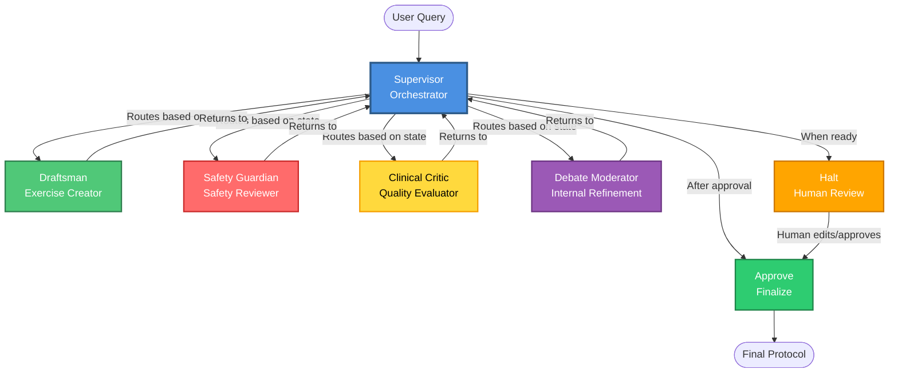
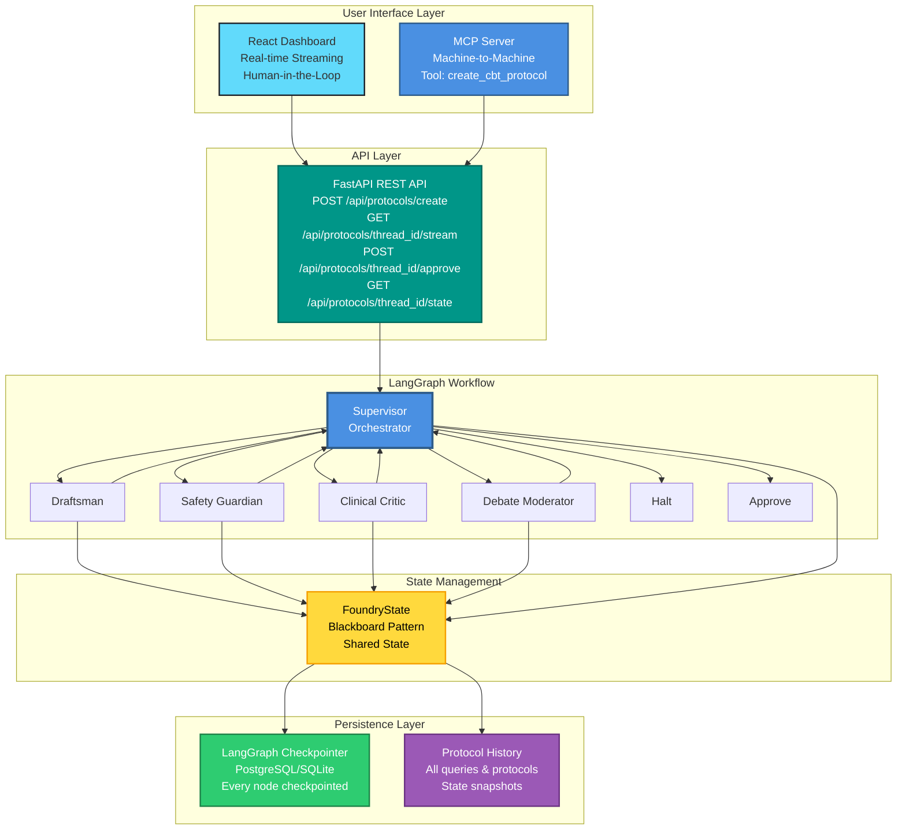
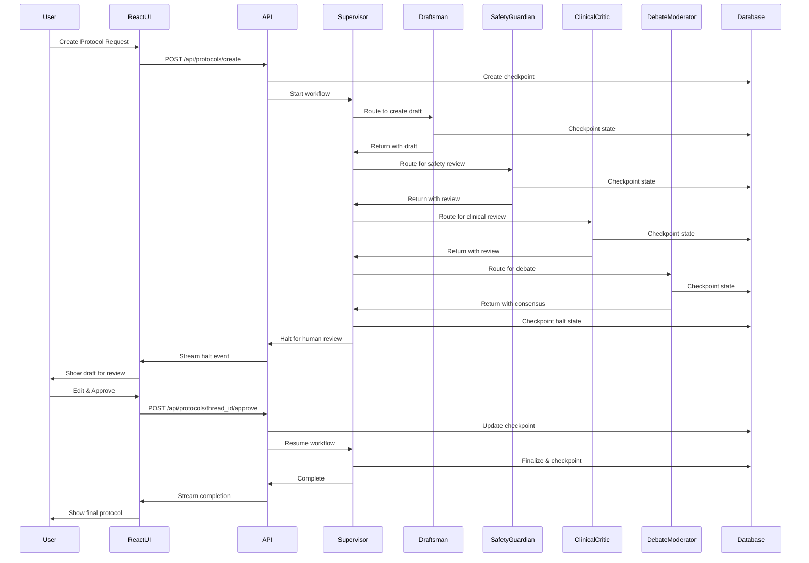
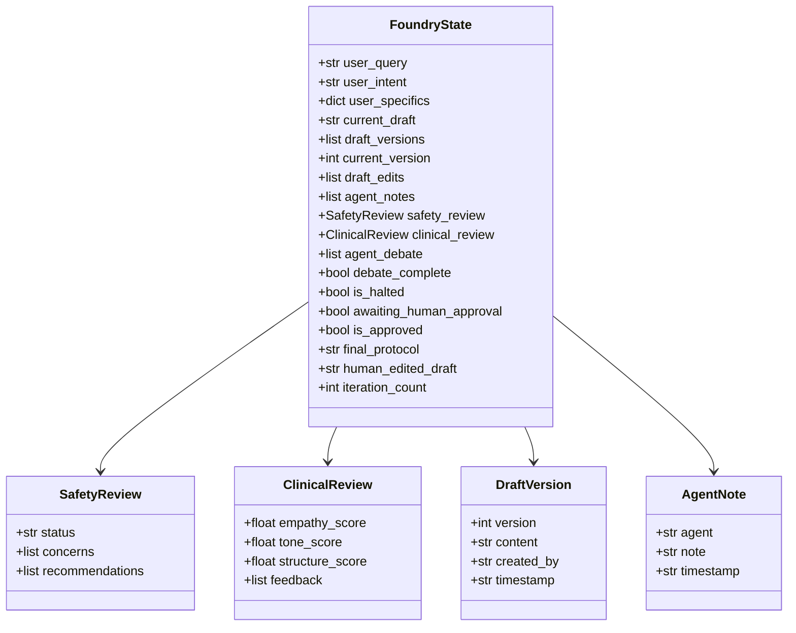

# Cerina Protocol Foundry - Architecture Diagram

## Agent Topology (Supervisor-Worker Pattern)

```mermaid
graph TB
    Start([User Query]) --> Supervisor[Supervisor<br/>Orchestrator]
    
    Supervisor -->|Routes based on state| Draftsman[Draftsman<br/>Exercise Creator]
    Supervisor -->|Routes based on state| SafetyGuardian[Safety Guardian<br/>Safety Reviewer]
    Supervisor -->|Routes based on state| ClinicalCritic[Clinical Critic<br/>Quality Evaluator]
    Supervisor -->|Routes based on state| DebateModerator[Debate Moderator<br/>Internal Refinement]
    Supervisor -->|When ready| Halt[Halt<br/>Human Review]
    Supervisor -->|After approval| Approve[Approve<br/>Finalize]
    
    Draftsman -->|Returns to| Supervisor
    SafetyGuardian -->|Returns to| Supervisor
    ClinicalCritic -->|Returns to| Supervisor
    DebateModerator -->|Returns to| Supervisor
    
    Halt -->|Human edits/approves| Approve
    Approve --> End([Final Protocol])
    
    style Supervisor fill:#4A90E2,stroke:#2E5C8A,stroke-width:3px,color:#fff
    style Draftsman fill:#50C878,stroke:#2E7D4E,stroke-width:2px,color:#fff
    style SafetyGuardian fill:#FF6B6B,stroke:#C92A2A,stroke-width:2px,color:#fff
    style ClinicalCritic fill:#FFD93D,stroke:#F59F00,stroke-width:2px,color:#000
    style DebateModerator fill:#9B59B6,stroke:#6C3483,stroke-width:2px,color:#fff
    style Halt fill:#FFA500,stroke:#CC7700,stroke-width:2px,color:#fff
    style Approve fill:#2ECC71,stroke:#1E8449,stroke-width:2px,color:#fff
```

## System Architecture (Full Stack)

```mermaid
graph TB
    subgraph "User Interface Layer"
        ReactUI[React Dashboard<br/>Real-time Streaming<br/>Human-in-the-Loop]
        MCPServer[MCP Server<br/>Machine-to-Machine<br/>Tool: create_cbt_protocol]
    end
    
    subgraph "API Layer"
        FastAPI[FastAPI REST API<br/>POST /api/protocols/create<br/>GET /api/protocols/thread_id/stream<br/>POST /api/protocols/thread_id/approve<br/>GET /api/protocols/thread_id/state]
    end
    
    subgraph "LangGraph Workflow"
        Supervisor[Supervisor<br/>Orchestrator]
        Draftsman[Draftsman]
        SafetyGuardian[Safety Guardian]
        ClinicalCritic[Clinical Critic]
        DebateModerator[Debate Moderator]
        Halt[Halt]
        Approve[Approve]
    end
    
    subgraph "State Management"
        FoundryState[FoundryState<br/>Blackboard Pattern<br/>Shared State]
    end
    
    subgraph "Persistence Layer"
        Checkpointer[LangGraph Checkpointer<br/>PostgreSQL/SQLite<br/>Every node checkpointed]
        History[Protocol History<br/>All queries & protocols<br/>State snapshots]
    end
    
    ReactUI --> FastAPI
    MCPServer --> FastAPI
    FastAPI --> Supervisor
    
    Supervisor --> Draftsman
    Supervisor --> SafetyGuardian
    Supervisor --> ClinicalCritic
    Supervisor --> DebateModerator
    Supervisor --> Halt
    Supervisor --> Approve
    
    Draftsman --> Supervisor
    SafetyGuardian --> Supervisor
    ClinicalCritic --> Supervisor
    DebateModerator --> Supervisor
    
    Draftsman --> FoundryState
    SafetyGuardian --> FoundryState
    ClinicalCritic --> FoundryState
    DebateModerator --> FoundryState
    Supervisor --> FoundryState
    
    FoundryState --> Checkpointer
    FoundryState --> History
    
    style ReactUI fill:#61DAFB,stroke:#20232A,stroke-width:2px
    style MCPServer fill:#4A90E2,stroke:#2E5C8A,stroke-width:2px,color:#fff
    style FastAPI fill:#009688,stroke:#00695C,stroke-width:2px,color:#fff
    style Supervisor fill:#4A90E2,stroke:#2E5C8A,stroke-width:3px,color:#fff
    style FoundryState fill:#FFD93D,stroke:#F59F00,stroke-width:2px,color:#000
    style Checkpointer fill:#2ECC71,stroke:#1E8449,stroke-width:2px,color:#fff
    style History fill:#9B59B6,stroke:#6C3483,stroke-width:2px,color:#fff
```

## Data Flow

```mermaid
sequenceDiagram
    participant User
    participant ReactUI
    participant API
    participant Supervisor
    participant Draftsman
    participant SafetyGuardian
    participant ClinicalCritic
    participant DebateModerator
    participant Database
    
    User->>ReactUI: Create Protocol Request
    ReactUI->>API: POST /api/protocols/create
    API->>Database: Create checkpoint
    API->>Supervisor: Start workflow
    
    Supervisor->>Draftsman: Route to create draft
    Draftsman->>Database: Checkpoint state
    Draftsman->>Supervisor: Return with draft
    
    Supervisor->>SafetyGuardian: Route for safety review
    SafetyGuardian->>Database: Checkpoint state
    SafetyGuardian->>Supervisor: Return with review
    
    Supervisor->>ClinicalCritic: Route for clinical review
    ClinicalCritic->>Database: Checkpoint state
    ClinicalCritic->>Supervisor: Return with review
    
    Supervisor->>DebateModerator: Route for debate
    DebateModerator->>Database: Checkpoint state
    DebateModerator->>Supervisor: Return with consensus
    
    Supervisor->>Database: Checkpoint halt state
    Supervisor->>API: Halt for human review
    API->>ReactUI: Stream halt event
    ReactUI->>User: Show draft for review
    
    User->>ReactUI: Edit & Approve
    ReactUI->>API: POST /api/protocols/thread_id/approve
    API->>Database: Update checkpoint
    API->>Supervisor: Resume workflow
    Supervisor->>Database: Finalize & checkpoint
    Supervisor->>API: Complete
    API->>ReactUI: Stream completion
    ReactUI->>User: Show final protocol
```

## State Structure (Blackboard Pattern)

```mermaid
classDiagram
    class FoundryState {
        +str user_query
        +str user_intent
        +dict user_specifics
        +str current_draft
        +list draft_versions
        +int current_version
        +list draft_edits
        +list agent_notes
        +SafetyReview safety_review
        +ClinicalReview clinical_review
        +list agent_debate
        +bool debate_complete
        +bool is_halted
        +bool awaiting_human_approval
        +bool is_approved
        +str final_protocol
        +str human_edited_draft
        +int iteration_count
    }
    
    class SafetyReview {
        +str status
        +list concerns
        +list recommendations
    }
    
    class ClinicalReview {
        +float empathy_score
        +float tone_score
        +float structure_score
        +list feedback
    }
    
    class DraftVersion {
        +int version
        +str content
        +str created_by
        +str timestamp
    }
    
    class AgentNote {
        +str agent
        +str note
        +str timestamp
    }
    
    FoundryState --> SafetyReview
    FoundryState --> ClinicalReview
    FoundryState --> DraftVersion
    FoundryState --> AgentNote
```

